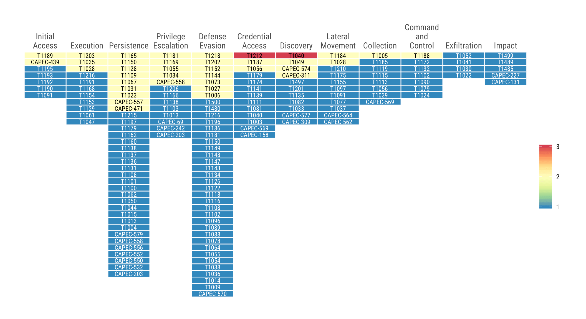

[](https://www.repostatus.org/#wip)
[](https://keybase.io/hrbrmstr)

[](https://travis-ci.org/hrbrmstr/attckr)  


# attckr

Analyze Adversary Tactics and Techniques Using the MITRE ATT\&CK CTI
Corpus

## Description

MITRE ATT\&CK is a globally-accessible knowledge base of adversary
tactics and techniques based on real-world observations. The ATT\&CK
knowledge base is used as a foundation for the development of specific
threat models and methodologies in the private sector, in government,
and in the cybersecurity product and service community. Tools are
provided to analyze adversary tactics and techniques, build incident
metrics, and identify high level program gaps using the MITRE ATT\&CK
CTI Corpus.

## What’s Inside The Tin

The following functions are implemented:

  - `attck_map`: Generate an ATT\&CK heatmap
  - `enterprise_attack`: Enterprise Attack Taxonomy v2.0
  - `fct_tactic`: Make an ordered Tactics factor with optional better
    labelling
  - `mobile_attack`: Mobile Attack Taxonomy v2.0
  - `pre_attack`: Pre-Attack Taxonomy v2.0
  - `read_events`: Read in ATT\&CK events from a file
  - `tactics_f`: Tactics factors (generally for sorting &
    pretty-printing)
  - `tidy_attack`: Combined ATT\&CK Matricies Tactics, Techniques and
    Technique detail
  - `validate_tactics`: Validate Tactics strings against MITRE
    authoritative source
  - `validate_technique_ids`: Validate Technique IDs
  - `validate_techniques`: Validate Techniques strings against MITRE
    authoritative source

The following datasets are included:

  - `enterprise_attack`: Enterprise Attack Taxonomy v2.0
  - `mobile_attack`: Mobile Attack Taxonomy v2.0
  - `pre_attack`: Pre-Attack Taxonomy v2.0
  - `tactics_f`: Tactics factors (generally for sorting &
    pretty-printing)
  - `tidy_attack`: Combined ATT\&CK Matricies Tactics, Techniques and
    Technique detail

## Installation

``` r
install.packages("attckr", repos = "https://cinc.rud.is")
# or
remotes::install_git("https://git.rud.is/hrbrmstr/attckr.git")
# or
remotes::install_git("https://git.sr.ht/~hrbrmstr/attckr")
# or
remotes::install_gitlab("hrbrmstr/attckr")
# or
remotes::install_bitbucket("hrbrmstr/attckr")
# or
remotes::install_github("hrbrmstr/attckr")
```

NOTE: To use the ‘remotes’ install options you will need to have the
[{remotes} package](https://github.com/r-lib/remotes) installed.

## Usage

``` r
library(attckr)
library(hrbrthemes)
library(tidyverse)

# current version
packageVersion("attckr")
## [1] '0.1.0'
```

``` r
tidy_attack
## # A tibble: 708 x 5
##    technique          description                                                        id      tactic        matrix   
##    <chr>              <chr>                                                              <chr>   <chr>         <chr>    
##  1 .bash_profile and… "<code>~/.bash_profile</code> and <code>~/.bashrc</code> are exec… T1156   persistence   mitre-at…
##  2 Access Token Mani… "Windows uses access tokens to determine the ownership of a runni… T1134   defense-evas… mitre-at…
##  3 Access Token Mani… "Windows uses access tokens to determine the ownership of a runni… T1134   privilege-es… mitre-at…
##  4 Accessibility Fea… "Windows contains accessibility features that may be launched wit… T1015   persistence   mitre-at…
##  5 Accessibility Fea… "Windows contains accessibility features that may be launched wit… T1015   privilege-es… mitre-at…
##  6 Accessibility Fea… "Windows contains accessibility features that may be launched wit… CAPEC-… persistence   mitre-at…
##  7 Accessibility Fea… "Windows contains accessibility features that may be launched wit… CAPEC-… privilege-es… mitre-at…
##  8 Account Discovery  "Adversaries may attempt to get a listing of local system or doma… T1087   discovery     mitre-at…
##  9 Account Discovery  "Adversaries may attempt to get a listing of local system or doma… CAPEC-… discovery     mitre-at…
## 10 Account Manipulat… Account manipulation may aid adversaries in maintaining access to… T1098   credential-a… mitre-at…
## # … with 698 more rows
```

``` r
events <- read_events(system.file("extdat/sample-incidents.csv.gz", package = "attckr"))
## Parsed with column specification:
## cols(
##   event_id = col_character(),
##   incident_id = col_character(),
##   event_ts = col_date(format = ""),
##   detection_ts = col_date(format = ""),
##   tactic = col_character(),
##   technique = col_character(),
##   discovery_source = col_character(),
##   reporting_source = col_character(),
##   responder_id = col_character()
## )
## You appear to be using Tactic ids.
## You appear to be using Techinque ids.

attck_map(
  events, "pretty", "nl", "enterprise",
  dark_value_threshold = 1,
  size = 3, family = font_rc, lineheight = 0.875
) +
  scale_fill_distiller(
    palette = "Spectral", na.value = "white", label = scales::comma, breaks = 1:3
  ) +
  labs(x = NULL, y = NULL, fill = NULL) +
  theme_ipsum_rc(grid="") +
  theme(axis.text.y = element_blank())
```



## attckr Metrics

| Lang | \# Files |  (%) | LoC |  (%) | Blank lines |  (%) | \# Lines |  (%) |
| :--- | -------: | ---: | --: | ---: | ----------: | ---: | -------: | ---: |
| R    |       11 | 0.92 | 245 | 0.91 |          65 | 0.76 |      166 | 0.83 |
| Rmd  |        1 | 0.08 |  24 | 0.09 |          20 | 0.24 |       34 | 0.17 |

## Code of Conduct

Please note that this project is released with a Contributor Code of
Conduct. By participating in this project you agree to abide by its
terms.
